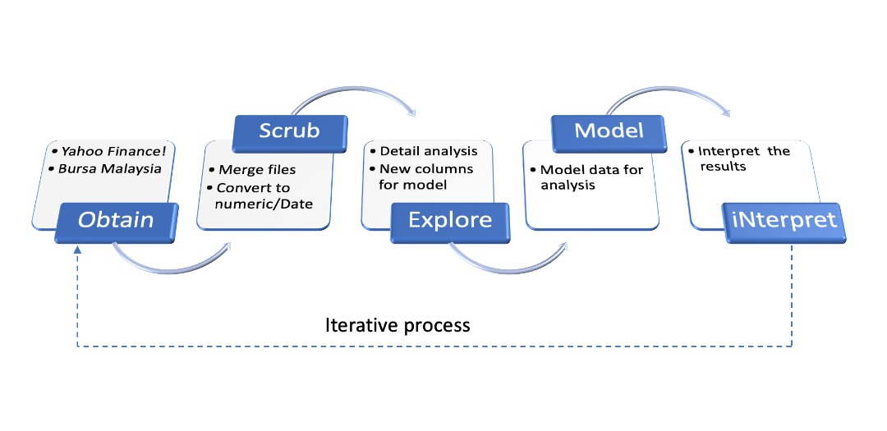

Starry Nine: A rookie investor's reference
========================================================
css: style.css

 

<i>Analysis of Bursa Malaysia Stock Market during Covid-19 Pandemic</i>
 

WQD7001: Group Project (Sem 2 2020/2021)

  

Thinzar Oo (17219923) 
Sim Jia Yik (s2025160) 
Hui Ting Chow (s2032914) 
Goh Ting Sheng (s2032766)

Background
========================================================

Introduction

<ol>The covid-19 pandemic affected globally, stock market is not an exception. Our group is interested to study its impact on the Malaysia Stock Market between January 2020 to May 2021.</ol>

Objectives

<ul>
<li>To present the general overview of the Malaysia stock market</li>
<li>To allow users to compare stocks or view details of each stock over time</li>
<li>To present our analysis to help amateur investors like us to make well-informed decisions</li>
</ul>

Research Questions

<ol>
<li>How did Bursa Malaysia stock market perform during the covid-19 pandemic?</li>
<li>Which sectors are the most affected by the pandemic?</li>
</ol>

Methodology (OSEMN Model)
========================================================

</img>

Main Features
========================================================

<b>1. Market Overview</b>

Allow users to understand the 30 constituent stocks under FBM KLCI index: data table, treemap, time-series chart

<b>2. Stock Explorer</b>

Users can study the performance (price and volume) of each stock based on desired time interval

3. Stock Comparison

Let users to choose up to 3 stocks and make comparisons.

4. Analysis By Sector details

Analysis can be made per sector. You can choose:  
<ul>
  <li>Daily closing price</li>
  <li>Price Trend</li>
  <li>Rate of change</li>
</ul>
 
Furthermore, additional reference line can be added to check whether the Movement Control Orders (MCO) or the announcement of vaccine affect the market performance.

Conclusion
========================================================

Challenges and lesson learnt

<ul>
<li>placeholder</li>
</ul>

References

<ul>
  <li>CSS Theme: 
      <a href="http://wrapbootstrap.com/preview/WB0JR603C">
      http://wrapbootstrap.com/preview/WB0JR603C</a>
  </li>
  
  <li>Stock market technical indicators:
      <a href="https://bookdown.org/kochiuyu/Technical-Analysis-with-R/technical-indicators.html">
      https://bookdown.org/kochiuyu/Technical-Analysis-with-R/technical-indicators.html</a>
  </li>
  
  <li>Stock Market Analysis: 
      <a href="http://rstudio-pubs-static.s3.amazonaws.com/495641_b5c18cffd89941a3baf43c1e5dde5ee2.html#introduction">
       http://rstudio-pubs-static.s3.amazonaws.com/495641_b5c18cffd89941a3baf43c1e5dde5ee2.html#introduction</a>
  </li>
</ul>

Check out our work

<ul>
  <li><a href="https://thinzar.shinyapps.io/StarryNineGroupProject/" target="_blank">Shiny app link</a></li>
  <li><a href="" target="_blank">Our video presentation</a>
  </li>
  <li>Source Code and datasets under our <a href="https://github.com/thinzaroo/wqd7001_group_project" target="_blank">Github</a></li>
</ul>

